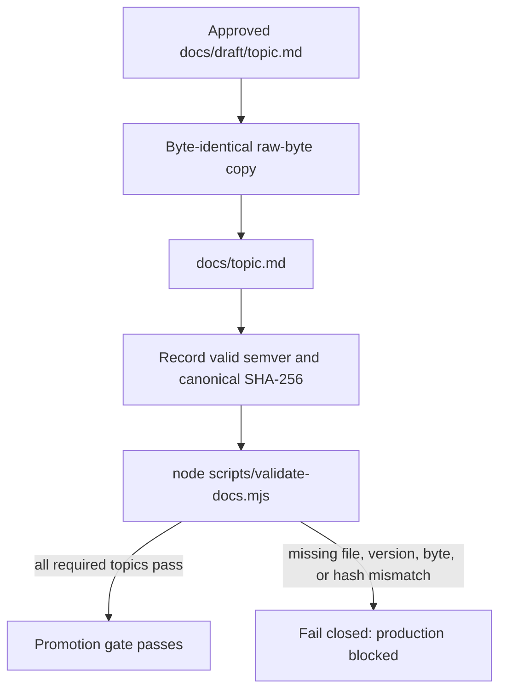

# Draft documentation registry

This directory contains the draft-only {{INITIATIVE}} documentation baseline. A draft is not canonical or production-approved.

## Promotion contract

Promotion is a copy-only operation. For an approved topic, copy raw bytes from `docs/draft/<topic>.md` byte-identically to `docs/<topic>.md`; do not reformat, normalize line endings, or otherwise edit either file during the copy. Then record a valid semantic version and SHA-256 digest of the raw canonical UTF-8 bytes in `docs/manifest.yaml`.

The repository-local gate is `node scripts/validate-docs.mjs`. It fails closed: every required topic must have draft and canonical files with matching raw bytes, a valid semantic version, and matching canonical SHA-256. Until all required rows are promoted, production is blocked.

## Required-topic registry

| Draft topic | Future canonical target | Criteria | Initial promotion status |
| --- | --- | --- | --- |
{{TOPIC_ROWS}}

Use [the tracking guide](../tracking/README.md) for authoring and promotion work.
